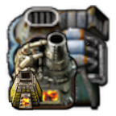

# Chained Recipes 

A Factorio mod that changes vanilla recipes to be chained a little more:  
every armor requires the previous one, same for furnaces, power poles, etc.

Factorio Mod Portal: https://mods.factorio.com/mod/chained-recipes

## Description

Creates or augments 19 chains. Examples:

* Armors
* Combinators
* Furnaces
* Inserters
* Power Poles
* Shells & Rockets

Introduces only 2 new intermediates and 1 new recipe. Other changes are directly in the existing recipes.

Confirmed compatible with Train Construction Site.  
Probably not compatible with overhaul mods.

## Changelog

See [mod/changelog.txt](mod/changelog.txt)

## Copyright

MIT License. Copyright (c) 2023 Yivry
